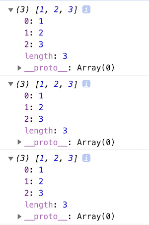

# Intro

앞서 this에 대해서 알아볼 때, `new 연산자의 작동 방식`과 `생성자 함수`가 무엇인지 간단하게 알아봤다. 이 부분에 대해서 좀 더 자세히 알아보자.

우리는 객체를 만들 때, 보통 `리터럴 방식`으로 만든다. 리터럴 방식이라 함은 `{ key : value ... }` 형식으로 만드는 것을 말한다. 하지만 함수를 통해서도 이러한 객체를 만들 수 있다. 정확히 말해서 **자바스크립트의 모든 객체는 함수를 통해서 생성된다.** 이 때 이 함수를 `생성자 함수`라고 한다. 그렇다면 이러한 생성자 함수는 무엇이 다른가? 일반 함수와 다른 점은 없다. 왜냐하면 모든 함수는 `생성자 함수가 될 수 있는 능력`을 갖고 있기 때문이다. 단, 관례적으로 생성자 함수임을 표현하기 위해서 `대문자로 표시`하고 생성자 함수의 능력을 발휘(?)하기 위해선 `new 연산자`와 같이 사용되어야 한다. 말로만 설명하면 이해하기 어려울수 있기 때문에 코드를 통해서 알아보자.

```javascript
function User(nickname, email) {
  console.log(this); // ??
  this.nickname = nickname;
  this.email = email;
}

const newUser1 = User('jjanmo1', 'jjanmo1@naver.com');
console.log(newUser1); // 1
const newUser2 = new User('jjanmo2', 'jjanmo2@naver.com');
console.log(newUser2); // 2
```

위의 코드는 어떤한 결과를 출력할까?

첫번째는 `일반 함수의 호출`이다. 1번에서 출력되는 값은 `undefined` 이다. 일반 함수의 경우 명시적으로 `return` 키워드를 사용하지 않으면 기본적으로 `undefined`를 반환한다. 그래서 위와 같은 결과값을 볼 수 있다.

두번째는 `생성자 함수의 호출`이다. 생성자 함수의 호출은 일반 함수의 호출과 다르게 작동하기 때문에 아래와 같은 결과를 얻을 수 있다. 이러한 결과값의 원인은 예상했던 대로 `new 연산자` 때문이다. (아래 이미지는 브라우저의 콘솔에서 나온 결과값이다.)

<br/>


위 이미지를 보면 3개의 파란색 상자가 보인다. 이 3가지가 무엇인지 말할 수 있을까? 대충 예상은 가능하지만 정확히 알고 싶은 욕구(?)가 샘솟는다.(아니라면 ㅈㅅ 😅) 이 궁금증을 해결하기 위해선 `new 연산자로 인해 일어나는 내부적인 메카니즘(?)`을 알아야한다.(앞에서 this를 공부할 때 간단하게 살펴보았지만 다시 한 번 복습삼아 살펴보자!) 더불어 `prototype`이 무엇인지 알아야한다. 이제 이것들에 대해서 살펴보도록 하자.

<br />

## New Operator 작동방식

```javascript
function Calculator() {
  this.number1 = 0;
  this.number2 = 0;

  this.read = function () {
    const [number1, number2] = prompt().split(' ');
    this.number1 = parseInt(number1, 10);
    this.number2 = parseInt(number2, 10);
  };

  this.sum = function () {
    return this.number1 + this.number2;
  };
}

const calculator = new Calculator();
```

> 브라우저에서 작동하는 간단한 덧셈 계산기이다.

<br />

`new <함수>`를 만나는 순간,

1. `빈 객체 { }` 가 생성된다.
2. `this`에 (위에서)생성된 빈 객체를 연결(할당)한다.
3. 함수의 본문으로 들어가서 해당 코드를 실행한다. 여기서 해당 객체(this)의 프로퍼티가 생성된다. this.<프로퍼티> 형식으로 추가된다.
4. **생성자 함수의 프로토타입(prototype) 객체**가 바인딩된 `__proto__`라는 프로퍼티가 해당 객체(this)에 추가한다.
5. `this`를 반환한다.

여기서 몇가지 이해가 안되는 부분들이 있을 것이다. 특히 `프로토타입 객체??`, `__proto__??` 이러한 것이 정확히 무엇을 의미하는지 알 수 없다. 그럼 위의 개념에 대해서 알아보자.

### 참고

Q1. new 연산자를 사용하고도 명시적으로 this에 다른 값을 할당한다면 어떻게 될까?

> 생성자 함수(new 사용시)는 명시적으로 반환값을 쓰지않아도 자동으로 this를 반환한다. 이 this에는 새로운 객체가 가져야할 프로퍼티를 모두 담은 것이다. 그런데 위의 의문처럼 새로운, 다른 객체를 반환한다면 생성자 함수에 의해 만들어진 인스턴스가 아니라 새로운, 다른 객체를 반환한다. 또 다른 점은 `__proto__`에 연결된 객체가 다르다는 것이다. 이 부분은 앞으로 알아갈 것이기 때문에 결과값이 어떻게 다른지 코드와 이미지로 보고만 가자.

> 반환값에 객체가 아닌 원시타입의 값을 반환한다면(return 'jjanmo' 처럼) 그 리턴문은 무시되고 기존의 this를 반환한다.

```javascript
function A() {
  this.number = 100;
}

const foo = new A();
console.log(foo); // 1

function B() {
  this.number = 100;

  return {
    name: 'jjanmo',
  };
}

const bar = new B();
console.log(bar); // 2
```


Q2. 어떤 경우 new를 붙이지 않아도 생성자 함수처럼 작동하는 경우가 있던데 그건 무엇때문에 그럴까?

```javascript
// 가장 보편적인 리터럴 방식의 배열 생성
var arr1 = [1, 2, 3];

// 생성자함수를 통한 배열 생성
var arr2 = new Array(1, 2, 3);

// ??
var arr3 = Array(1, 2, 3);

console.log(arr1);
console.log(arr2);
console.log(arr3);
```



위 이미지를 보면 3개 모두 같은 결과값을 갖는다. 우리가 알던 지식을 바탕으로 생각하면, new를 사용하지 않은 생성자 함수는 일반 함수의 호출과 같은 것으로 작동하는 것으로 알고 있는데 말이다. 이 이유는 자바스크립트는 빌트인 객체의 경우, new를 사용하지 않더라도 의도한바대로 새로운 객체(인스턴스)를 생성할 수 있도록 내부적으로 구현되어 있기 때문이다. 이러한 것을 `Scope-safe constructors`라고 부른다고 한다. (해당 빌트인 객체는 예를 들어 Object, Regex(정규표현식), Array 등이 있다.) 코드로는 어떻게 구현되어 있을지 살펴보자.

```javascript
function Fn(argument) {
  if (!(this instanceof Fn)) {
    return new Fn(argument);
  }
}
```

> new 연산자로 생성자 함수가 호출되면 this가 생성자 함수에 의해 생성된 객체(인스턴스)에 할당된다. 하지만 new가 없다면 일반함수 호출로서 this는 window를 의미하기 때문에 해당 if문에 부합하게 되어 `new Fn()`이 작동하게 되는 것이다.

> `instanceof`를 간단하게 이해하면 해당 객체가 생성자 함수에 의해서 만들어진 객체(인스턴스)인지 여부를 알려준다라고 생각할 수 있다. 물론 이 말도 맞지만(이렇게 따지면 다른 경우가 생긴다.) 엄밀하게 말하면 `생성자의 prototype 속성이 객체의 프로토타입 체인 어딘가 존재하는지 판별합니다` 라고 [MDN](https://developer.mozilla.org/ko/docs/Web/JavaScript/Reference/Operators/instanceof)에 적혀있다. 프로토타입에 대해서 알게 되면 이 말을 좀 더 명확하게 이해할 수 있을 것이다.

<br />

## 프로토타입(Prototype)

> 원형, 원초적인 형태, 공학에서는 초기모델

> 프로토타입에 대해서 알기 전에 위에서 언급했던 두가지를 기억해보자. **첫번째**는 `모든 객체는 함수를 통해서 만들어진다`. **두번째**는 그렇게 만들어진 `객체 안에는 __proto__라는 프로퍼티가 들어있다`.(생성자 함수에 의해서 객체가 생성될 때의 과정을 떠올려보자.)

모든 함수는 생성될 때, 자신의 원형, 자신의 모체를 가지고 태어난다. 이것이 프로토타입 객체이다. 뭔가 이상한가? 프로그래밍적(?)으로 설명하면, 내부적으로 자바스크립트 엔진은 함수가 생성될 때, 익명의 `프로토타입 객체`를 생성한다. 하지만 이 프로토타입 객체에는 익명이기 때문에 직접 접근 할 수 없다. 대신 함수의 `prototype`이라는 프로퍼티가 이 객체를 참조하게 만들었다. 아래 코드를 보면서 생성자 함수와 이것을 생성된 객체(인스턴스) 내부를 관찰해보자! 🚀

```javascript
function Human(name) {
  this.name = name;
}

console.dir(Human); // 1)

const human1 = new Human('jjanmo');
console.dir(human1); // 2)
```

<br />


> 코드 1번 결과값

위 이미지는 1번 코드의 결과값으로 Human 생성자 함수에 대해서 살펴볼 수 있다. `f Human(name)` 을 열어보면 그 밑에 있는 모든 것은 해당 함수의 프로퍼티이다. 그 중에 위에서 언급한 `prototype` 이라는 프로퍼티(파란 박스)와 `__proto__` 프로퍼티(빨간 박스)를 볼 수 있다. 또한 `prototype` 안에는 다시 `constructor` 라는 프로퍼티가 있다. 여기서 이상한 점이 보인다. `constructor` 옆에 쓰여있는 것인 맨 위에 쓰여 있는 `f Human(name)`와 같다. 또한 안에 있는 내용도 어디선가 많이 본 프로퍼티들이다. 바로 Human 생성자 함수와 같다. 이게 어떻게 된 것인지 다이어그램으로 살펴보자.

<br />


> 다이어그램1

위에서도 언급했듯이 함수가 생성될 때 프로토타입 객체가 생성되어서 그 객체의 (주소)값이 생성자 함수의 프로퍼티인 prototype에 바인딩된다. 그런데 이와 동시에 그 프로토타입 객체에도 `constructor` 라는 프로퍼티에 생성자함수의 (주소)값이 바인딩된다. 즉 이 둘은 서로 참조하는 관계가 형성되는 것이다. 이러한 동작은 내부적으로 당연하게, 자동적으로 일어난다. 왜 이렇게 상호 참조를 하게 만들었을까?

이유를 예상해보면, 생성된 새로운 객체(인스턴스)가 어떤 생성자에 의해서 만들어졌는지를 **프로토타입 객체를 통해서 알기 위해서** 상호 참조하게 만들어 놓은 것이 아닐까. 상속관계가 복잡해지면 자신이 어떤 생성자 함수에 의해서 만들어졌는지를 알기 어려워지는 상황이 나타날 수도 있기때문이다.

여기서 약간 의문인 부분이 있다. 위의 말을 이해해보면 생성된 객체에서 자신의 생성자 함수를 알기 위해서 프로토타입 객체에 접근할 수 있다라고 말하고 있다. 어떻게 그럴 수 있지? 이 부분이 바로 `프로토타입 링크(Prototype Link)`에 해당하는 것이다. 즉, 지금까지 지속적으로 등장했지만 정확히 알지 못했던 그 `__proto__` 이다. 이제부터 이 부분을 알아보자.

<br />


> 코드 2번 결과값

위 결과값에서 빨간 박스가 `__proto__`이다. `__proto__`는 `Human 생성자 함수의 prototype 프로퍼티`를 참조한다. 즉 생성된 객체의 상위 프로토타입 객체와 연결되는 것이다.

다시 한 번 `__proto__`에 대해서 정리해보자. `__proto__`는 객체가 생성될 때, 모두 갖게 되는 프로퍼티이다. 이 프로퍼티는 그 객체를 만든 생성자 함수의 prototype 프로퍼티(즉, 프로토타입 객체)를 참조한다. 그래서 이를 `프로토타입 링크(Prototype Link)`라고 부른다. 또한 `__proto__`를 `[[prototype]]` 표현하기도 한다. 참고로 `__proto__`를 `던더프로토`라고도 부른다. 지금까지의 상황을 다시 한 번 다이어그램으로 정리해보자.

<br />


> 다이어그램2

<br />

## Prototype Chain

방금까지 위에서 조금은 단순한(?) 다이어그램을 살펴보았다. 그럼 이제 아래의 다이어그램을 보자. 뭔가 좀 더 복잡해보인다. 하지만 절대 겁먹지말자. 사실은 위에서 배운 것들의 **반복**이기 때문이다.


// 다이어그램 설명 추가

<br />

## Prototype의 필요성

지금까지 프로토타입에 대해서 알아보았다. 그렇다면 왜 우리는 프로토타입을 사용해야하는가? 이 질문에 대해서 이번에 정리하면서 다시 깨닫게(?) 되었다. 사실 이 부분에 대한 답이 명확하게 적혀있는 책을 본적이 있다. 하지만 그 때는 글로서만 이해하고 진정으로 이해하지 못했던 것 같다. 시간이 흐르고 이번에 다시 프로토타입에 대해서 정리하면서 스스로 이런 **질문**을 하게 되었다.

`'아니 생성자 함수로만으로도 변수와 메서드를 다 만들고 생성해서 사용할 수 있는데 굳이 프로토타입을 이용해서 상속과 같은 기능을 구현해서 사용해야만 하는거야??'`

그러면서 스스로 예전에 이해했던 기억과 스스로 가진 의문에 대한 해답이 겹쳐지면서 좀 더 깊이 있는 이해를 하게 되었다. 자 이제 그 이해를 풀어보도록 하겠다. 😄

<br />

## instanceof operator

위에서 프로토타입을 알게되면 이해된다고 했던 부분이 있다. 바로 `instanceof 연산자`이다.

사용하는 방법은 `object instanceof constructor` 이다. 쉽게 말해서 앞에는 **판별할 객체**, 뒤에는 **해당 객체의 생성자**이다. 즉 to instanceof from 이라고 말할 수 있겠다. 그런데 위에서 말한 instanceof에 대한 기능을 설명한 것을 다시 기억해보자. `생성자의 prototype 속성이 객체의 프로토타입 체인 어딘가 존재하는지 판별`하는 것이라고 했다. 사용하는 방법과 기능에 대해 설명한 부분이 뭔가 매칭이 잘 안된다는 느낌이 든다.(적어도 나는 그랬다...😅) 몇가지 예시를 통해서 위의 정의가 정확히 무슨 말을 하는지에 대해서 알아보자.

```javascript
function User(name, age) {
  this.name = name;
  this.age = age;
}

const user1 = new User('jjanmo', 25);

console.log(user1 instanceof User); // 1) ??
console.log(user1 instanceof Object); // 2) ??
```

1번 결과값은 true 이다. 생각했던 대로이다. 왜냐하면 user1은 User 생성자로부터 만들어졌기 때문에 그에 대한 인스턴스(객체)라고 생각할 수 있기 때문이다. 쉽게 생각하면 이렇게만 생각해도 된다. 자 이제 2번의 결과값이 무엇이 나올지 생각해보자. 1번 처럼 해석한다고 가정하면, user1은 Object 생성자로부터 만들어진 것이 아니기 때문에 false 라는 결과값을 예상할 수 있다. 하지만 결과값은 true이다. 왜?? 그렇다면 어떤 부분의 해석이 잘못되었을까?

우선 instanceof의 기능을 다시 한 번 살펴보면, 단순하게 생성자 함수와 그로 부터 생성된 객체와의 관계를 의미하는 것이 아니다. 생성자의 프로토타입 속성이 해당 객체의 프로토타입 체인에 있는지 여부를 판단하는 것이다. 즉 1번은 User.prototype 이 user1의 프로토타입 체인 어딘가에 존재하면 true인 것이고, 마찬가지로 Object.prototype이 user1의 프로토타입 체인 어딘가에 존재하면 true인 것이다. 방금 말을 좀 더 직관적으로 이해하기 위해서 user1의 프로토타입 체인을 그려보자.


위의 이미지는 prototype이 null이 나올 때까지 프로토타입 링크를 타고 올라가는 프로토타입 체인(분홍색)을 그린 것이다. 이 프로토타입 체인을 기준으로 체인 안 User.prototype 이나 Object.prototype이 존재한다면 instanceof 연산자의 결과값이 true가 된다. 정확하게 User.prototype과 Object.prototype이 존재함을 확인 할 수 있다.

자 그럼 퀴즈를 하나 풀어보자. 아래의 출력값이 무엇이 나올지 예상이 되는가?
(해당 퀴즈는 모던 JavaScript 튜토리얼의 [instanceof 파트](https://ko.javascript.info/instanceof)에서 인용한 부분입니다.)

```javascript
function A() {}
function B() {}

A.prototype = B.prototype = {};

let a = new A();

console.log(a instanceof B); // ??

let b = new B();
console.log(b instanceof A); // ??
```

> 프로토타입 속성은 내부적으로 익명 객체를 할당한 것이다(즉, 특정 객체의 주소값이 할당된 것). 그렇기 때문에 위에서 처럼 특정값을 재할당할 수 있고(변경 가능), 실제로 이를 이용해서 상속의 관계를 구현한다. 상속 관계를 어떻게 구현하는지는 다음 편에서 좀 더 자세히 다뤄보도록 하겠다. 우선 여기서는 저런 식으로 재할당하여 변경할 수 있다는 정도만 알아두자. 또한 이 퀴즈가 잘 이해가 안된다면 위에서 한 것처럼 도식화해보자!!


이 모식도를 보면 위의 결과값이 모두 true 라는 것을 알 수 있을 것이다. 위의 코드를 보면 B.prototype을 A.prototype에 할당했기 때문에 결국 생성자 함수 A에 의해서 만들어진 객체와 생성자 함수 B에 의해서 만들어진 객체는 결국 같은 프로토타입 링크를 갖게 되는 것이다.

이렇게 instanceof에 대해서 살펴보았다. 하지만 **급의문**이 드는 부분이 있을 것이다. `그래서 이거 어떻게 사용하라고??` 사실 솔직하게 나도 단순한 구조의 프로토타입 체인에서만 사용해본 경험밖에 없다. 다시 말해 단순하게 사용하면 위의 모식도처럼 프로토타입 체인을 의식하지 않고도 instanceof 의 결과값을 예측할 수 있을 것이다. 하지만 `복잡한 상속 구조, 계층 구조 속에서 해당 객체가 어떠한 상속 구조를 갖고 있는지`를 알기 위해선 instanceof에 대한 좀 더 명확한 이해가 필요할 것이라고 생각한다. 이러한 부분은 점차적으로 자바스크립트의 OOP를 학습하면서 경험해보도록 하겠다.
