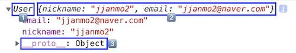

# Intro

앞서 this에 대해서 알아볼 때, `new 연산자의 작동 방식`과 `생성자 함수`가 무엇인지 간단하게 알아봤다. 이 부분에 대해서 좀 더 자세히 알아보자.

우리는 객체를 만들 때, 보통 `리터럴 방식`으로 만든다. 리터럴 방식이라 함은 `{ key : value ... }` 형식으로 만드는 것을 말한다. 하지만 함수를 통해서도 이러한 객체를 만들 수 있다. 정확히 말해서 **자바스크립트의 모든 객체는 함수를 통해서 생성된다.** 이 때 이 함수를 `생성자 함수`라고 한다. 그렇다면 이러한 생성자 함수는 무엇이 다른가? 일반 함수와 다른 점은 없다. 왜냐하면 모든 함수는 `생성자 함수가 될 수 있는 능력`을 갖고 있기 때문이다. 단, 관례적으로 생성자 함수임을 표현하기 위해서 `대문자로 표시`하고 생성자 함수의 능력을 발휘(?)하기 위해선 `new 연산자`와 같이 사용되어야 한다. 말로만 설명하면 이해하기 어려울수 있기 때문에 코드를 통해서 알아보자.

```javascript
function User(nickname, email) {
  console.log(this); // ??
  this.nickname = nickname;
  this.email = email;
}

const newUser1 = User('jjanmo1', 'jjanmo1@naver.com');
console.log(newUser1); // 1
const newUser2 = new User('jjanmo2', 'jjanmo2@naver.com');
console.log(newUser2); // 2
```

위의 코드는 어떤한 결과를 출력할까?

첫번째는 `일반 함수의 호출`이다. 1번에서 출력되는 값은 `undefined` 이다. 일반 함수의 경우 명시적으로 `return` 키워드를 사용하지 않으면 기본적으로 `undefined`를 반환한다. 그래서 위와 같은 결과값을 볼 수 있다.

두번째는 `생성자 함수의 호출`이다. 생성자 함수의 호출은 일반 함수의 호출과 다르게 작동하기 때문에 아래와 같은 결과를 얻을 수 있다. 이러한 결과값의 원인은 예상했던 대로 `new 연산자` 때문이다. (아래 이미지는 브라우저의 콘솔에서 나온 결과값이다.)

<br/>



위 이미지를 보면 3개의 파란색 상자가 보인다. 이 3가지가 무엇인지 말할 수 있을까? 대충 예상은 가능하지만 정확히 알고 싶은 욕구(?)가 샘솟는다.(아니라면 ㅈㅅ 😅) 이 궁금증을 해결하기 위해선 `new 연산자로 인해 일어나는 내부적인 메카니즘(?)`을 알아야한다.(앞에서 this를 공부할 때 간단하게 살펴보았지만 다시 한 번 복습삼아 살펴보자!) 더불어 `prototype`이 무엇인지 알아야한다. 이제 이것들에 대해서 살펴보도록 하자.

<br />

## New Operator 작동방식

`new <함수>`를 만나는 순간,

1. `빈 객체 { }`가 생성된다.
2. `this`에 (위에서)생성된 빈 객체를 할당한다.
3. 함수의 본문으로 들어가서 해당 코드를 실행한다. 여기서 해당 객체(this)의 프로퍼티가 생성된다. this.<프로퍼티> 형식으로 추가된다.
4. 생성자 함수의 prototype 객체가 바인딩된 `__proto__`라는 프로퍼티가 해당 객체(this)에 추가한다.
5. `this`를 반환한다.

### 참고

Scope-safe constructors

return 방식의 변경
